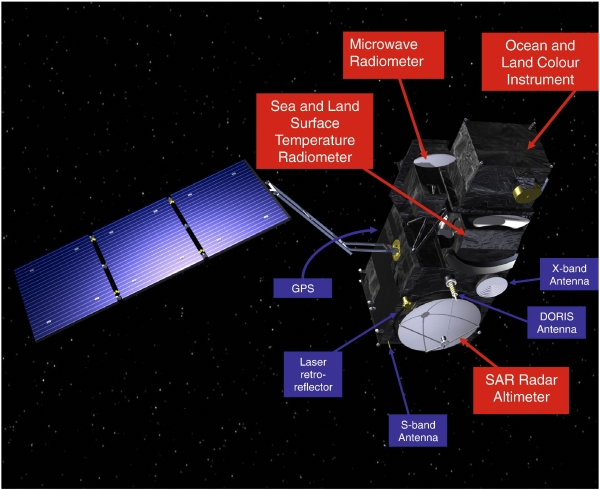
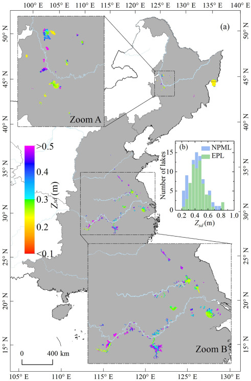
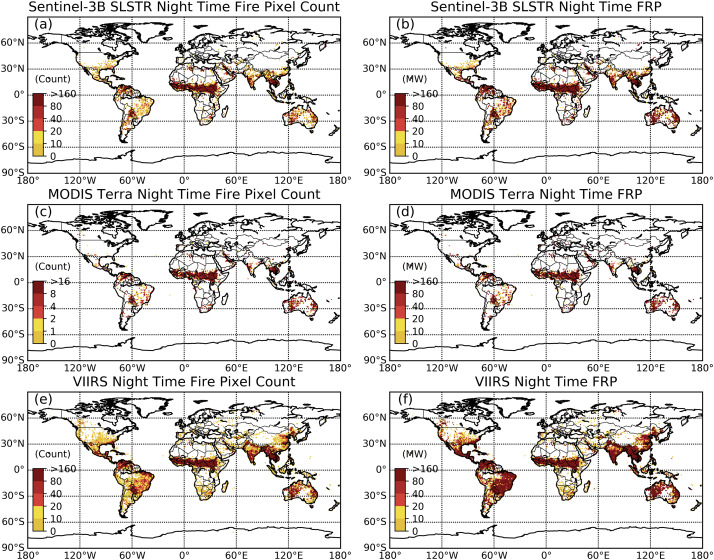
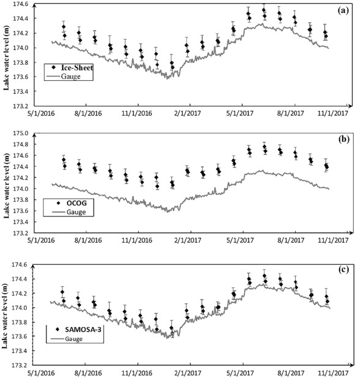
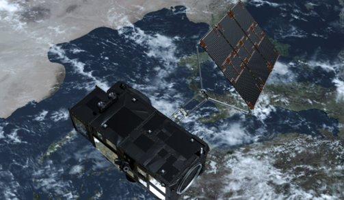

```{r xaringan-themer, include=FALSE, warning=FALSE}
library(xaringanthemer)
style_mono_light(
  base_color = "#23395b",
  header_font_google = google_font("Josefin Sans"),
  text_font_google   = google_font("Montserrat", "300", "300i"),
  code_font_google   = google_font("Fira Mono")
)
```

class: left, up

# SUMMARY

#### Sentinel-3 is a part of copernicus and made up of constellation of two radar imaging satellites operated by ESA and EUMETSAT.

#### Sentinel-3A was launched on 16 February 2016 and followed by Sentinel-3B on 25 April 2018, meanwhile Sentinel-3C and Sentinel-3D is expected to be launched as the new generation.

<div style="text-align: center;">
  <iframe width="560" height="315" 
          src="https://www.youtube.com/embed/RuOIWx8IWsY" 
          frameborder="0" allowfullscreen>
  </iframe>
</div>

---
class: left, up

.pull-left[
## SPECIFICATION

* High inclination orbit: 98.65 degree
* Low earth orbit: altitude 814.5 km
* Near-polar and sun-synchronous orbit
* Moderate size
* Designed for 7 years operational lifetime
* 27 days orbital cycle

]

.pull-right[


_Image credit:_ [**European Space Agency**](https://sentiwiki.copernicus.eu/web/s3-mission)
]

## INSTRUMENT

* OLCI (Ocean and Land Colour Instrument)
* SLSTR (Sea and Land Surface Temperature Radiometer)
* SRAL (Synthetic Aperture Radar Altimeter)

---

## RESOLUTION

<style>
  .tab {
    display: inline-block;
    padding: 10px 20px;
    margin: 0;
    font-size: 18px;
    cursor: pointer;
    border-bottom: 3px solid transparent;
  }
  .tab.active {
    border-bottom: 3px solid #800080;
    font-weight: bold;
  }
  .tab-content {
    display: none;
  }
  .tab-content.active {
    display: block;
  }
</style>

<div>
  <span class="tab active" onclick="showTab(0)">OLCI</span>
  <span class="tab" onclick="showTab(1)">SLSTR</span>
  <span class="tab" onclick="showTab(2)">SRAL</span>
</div>

<div class="tab-content active">
  <h4>OLCI (Ocean and Land Colour Instrument)</h4>
  <ul>
  <li>Spatial: 300 m</li>
  <li>Spectral: 21 bands (400 - 1,020 nm)</li>
  <li>Radiometric: 12-bit</li>
  <li>Temporal: 1-2 days (daily global)</li>
  </ul>
  <h4>Purposes</h4>
  <ul>
  <li>Ocean colour</li>
  <li>Vegetation</li>
  <li>Water quality</li>
  </ul>
</div>

</div>
<div class="tab-content">
  <h4>SLSTR (Sea and Land Surface Temperature Radiometer)</h4>
  <ul>
  <li>Spatial: 500 m (VIS/SWIR), 1 km (TIR)</li>
  <li>Spectral: 9 bands (VIS, SWIR, MWIR, TIR)</li>
  <li>Radiometric: 12-bit</li>
  <li>Temporal: 1-2 days (daily global)</li>
  </ul>
  <h4>Purposes</h4>
  <ul>
  <li>Land and sea surface temperature</li>
  <li>Fire detection</li>
  <li>Cloud properties</li>
  </ul>
</div>
  
</div>
<div class="tab-content">
  <h4>SRAL (Synthetic Aperture Radar Altimeter)</h4>
  <ul>
  <li>Spatial: 300 m along-track</li>
  <li>Spectral: Ku-band (13.575 GHz), C-band (5.41 GHz)</li>
  <li>Temporal: 27-day repeat cycle</li>
  </ul>
  <h4>Purposes</h4>
  <ul>
  <li>Sea level monitoring</li>
  <li>Ice topography</li>
  <li>Inland water levels</li>
  </ul>
</div>

<script>
  function showTab(index) {
    document.querySelectorAll(".tab").forEach((tab, i) => {
      tab.classList.toggle("active", i === index);
    });
    document.querySelectorAll(".tab-content").forEach((content, i) => {
      content.classList.toggle("active", i === index);
    });
  }
</script>

---

.pull-left[
# APPLICATIONS

### OLCI

### Water Quality Monitoring

#### Assessing the lake water quality in Eastern China using combination of Sentinel-3 OLCI and in-situ data with Random Forest Regression.

#### The figure shows two-year-mean turbidity of the Northeast Plain and Mountain Lake (NPML) zone and the Eastern Plain Lake (EPL) zone.
]

.pull-right[

_Image credit:_ [**Shen et al., 2020**](https://doi.org/10.1016/j.rse.2020.111950)
]

---

# APPLICATIONS

.pull-left[
### SLSTR

### Active Fire Detection

#### Enhancing active fire detection and fire radiative power retrieval globally using Sentinel-3 SLSTR, MODIS Terra, and VIIRS Nighttime Light intercomparison.

#### The figure shows total active fire pixel count and total fire radiative power of actively burning fires detected within 1 degree grid cells.
]

.pull-right[

_Image credit:_ [**Xu et al., 2020**](https://doi.org/10.1016/j.rse.2020.111947)
]

---

# APPLICATIONS

.pull-left[
### SRAL

### Water Levels over Ice-covered Lakes

#### Analyzing lake water levels over ice-covered lakes using Sentinel-3 SAR altimetry and in-situ gauge data with a bimodal correction algorithm.

#### The figure shows comparison of water level estimates from Sentinel-3 retrackers and the in-situ gauge measurements over Lake Erie during 2016–2017
]

.pull-right[

_Image credit:_ [**Shu et al., 2020**](https://doi.org/10.1016/j.rse.2020.111643)
]

---

# LIMITATIONS

#### The low resolution of Sentinel-3 making it difficult to use for small area studies.

#### The SLSTR might not suitable for UHI monitoring compared to Landsat 8/9 TIRS band due to low spatial resolution.

#### The OLCI and SRAL are only works for large ocean or water bodies.

#### The water quality assessment might get errors for highly turbid and aerosol region.

#### SLSTR detects fewer high-intensity fires, and its fire radiative power retrieval tends to be overestimated.

---

class: left, up

# REFLECTIONS

#### I think Sentinel-3 is offering a wide range of option for environmental studies, from water quality, surface temperature, fire detection, and ice sheet altimetry. Although the spatial resolution is low and might not suitable for small area studies. The daily coverage of OLCI and SLSTR is perfect for conducting daily time series analysis, especially for monitoring temperature or sea level change. I think Sentinel-3 is a good choice when conducting region-level, state-level, or global studies.

<div style="text-align: center;">
  ``


_Image credit:_ [**European Space Agency**](https://sentiwiki.copernicus.eu/web/s3-mission)

---

# REFERENCES

[**https://sentiwiki.copernicus.eu/web/sentinel-3**](https://sentiwiki.copernicus.eu/web/sentinel-3)

[**https://sentinels.copernicus.eu/web/sentinel/copernicus/sentinel-3**](https://sentinels.copernicus.eu/web/sentinel/copernicus/sentinel-3)

[**https://www.eoportal.org/satellite-missions/copernicus-sentinel-3#summary**](https://www.eoportal.org/satellite-missions/copernicus-sentinel-3#summary)

[**Shen, M. et al. (2020) ‘Sentinel-3 OLCI observations of water clarity in large lakes in eastern China: Implications for SDG 6.3.2 evaluation’, Remote Sensing of Environment, 247, p. 111950. Available at: https://doi.org/10.1016/j.rse.2020.111950.**](https://doi.org/10.1016/j.rse.2020.111950)

[**Shu, S. et al. (2020) ‘Analysis of Sentinel-3 SAR altimetry waveform retracking algorithms for deriving temporally consistent water levels over ice-covered lakes’, Remote Sensing of Environment, 239, p. 111643. Available at: https://doi.org/10.1016/j.rse.2020.111643.**](https://doi.org/10.1016/j.rse.2020.111643)

[**Xu, W. et al. (2020) ‘First study of Sentinel-3 SLSTR active fire detection and FRP retrieval: Night-time algorithm enhancements and global intercomparison to MODIS and VIIRS AF products’, Remote Sensing of Environment, 248, p. 111947. Available at: https://doi.org/10.1016/j.rse.2020.111947.**](https://doi.org/10.1016/j.rse.2020.111947)